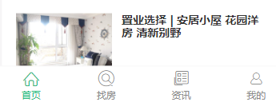
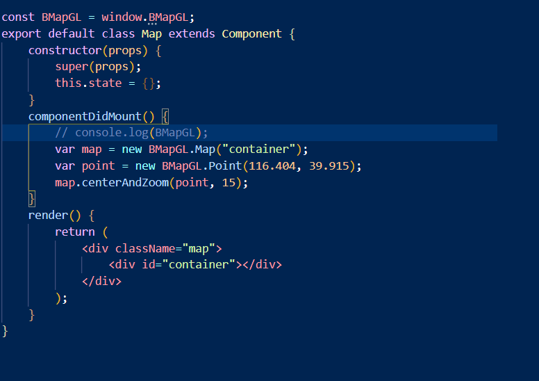
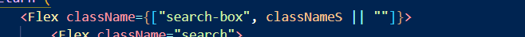
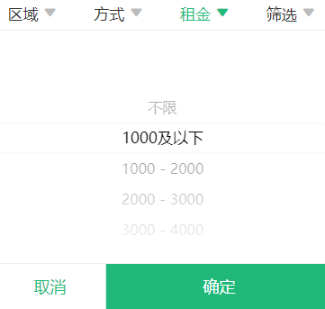
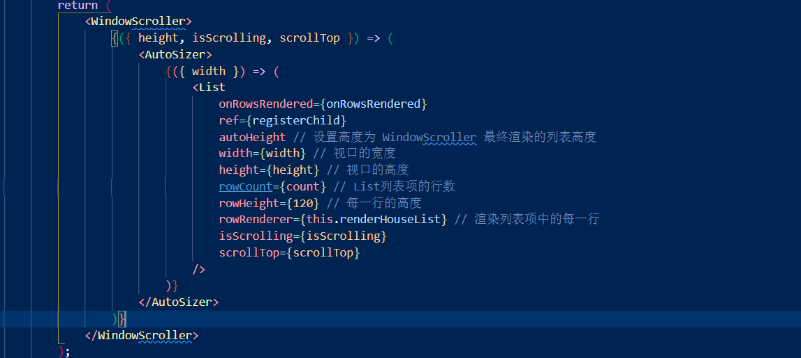
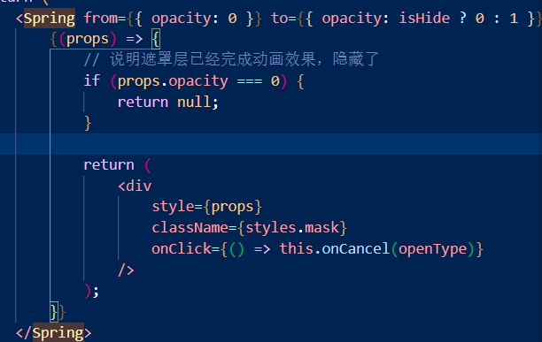

## 好客租房（移动端）

### **TabBar遮挡导致最后的内容展示不全**

- 问题原因：由于TabBar使用了绝对定位，导致内容覆盖
- 解决：给内容设置padding-bottom把内容顶上去




### 百度地图API 用来创建实例的元素，height必须设置高度，空标签height为0，在react的使用全局对象，要加window



### 获取当前城市地址

```js
import axios from "axios";
import { setStore, getStore } from "./store";
export default () => {
	const localCity = JSON.parse(getStore("hkzf_city"));
	if (!localCity) {
		return new Promise((resolve, reject) => {
			const curCity = new window.BMapGL.LocalCity();
			curCity.get(async (res) => {
				try {
					const result = await axios.get(
						`http://localhost:8080/area/info?name=${res.name}`
					);
					const {
						data: { body },
					} = result;
					setStore("hkzf_city", body);
					resolve(body);
				} catch (e) {
					reject(e);
				}
			});
		});
	}
	//统一返回的数据都是Promise
	return Promise.resolve(localCity);
};
```

### 长列表性能优化

懒渲染(常见于移动端)

- 原理：每次只渲染一部分数据，等渲染的数据即将滚动完，在渲染下面部分
- 优点：每次渲染一部分数据，速度快
- 缺点：数据量大时，页面节点变多，占用内存过多，降低浏览器渲染性能，导致页面卡顿
- 使用场景：数据量不大

### 可视区域渲染

- 原理：只渲染页面可视区域的列表项，以及部分非可视区域数据，避免滚动时数据加载不及时导致的白屏
- 使用场景：一次性展示大量的数据

### 组件间样式覆盖问题

在app.js里导入了组件也同时导入了样式，如果样式重名就会出现修改一个组件样式而改变其他组件的样式

- CSS IN JS : 使用JavaScript编写CSS的统称，用来解决CSS样式冲突、覆盖等问题

### 点击小区移动到中心位置

调用panBy()方法，移动地图到中间位置

- 垂直位移：(window.innerHeight - 330(房屋列表高度)) / 2 - target.clientY
- 水平位移：window.innerWidth / 2 - target.clientX

### className传入一个数组实现动态class



### 标题之间来回切换导致默leihui认值生效

在三个标题这件来回切换时，默认选中值不生效，点击确定或取消时，才生效

- 问题原因：由于没有重新创建FilterPicker组件，所以默认值没有生效

- 解决：添加key值,保持组件唯一,react会重新渲染组件

  

### List组件跟随页面滚动

- 问题原因：List默认只让组件出现滚动条，无法让整个页面滚动

- 解决：使用WindowScroller高阶组件提供height,使用AutoSizer为List组件提供width

  



### 筛选栏吸顶时，房屋列表会突然往上跳动相应高度

- 问题原因：由于给筛选栏设置了fixed，脱离了文档流,所以高度不计算
- 解决：给另一个div设置相应的高度

### react-spring

form属性只表示初次渲染，to属性决定动画效果



#### formik/yup表单处理和校验 

