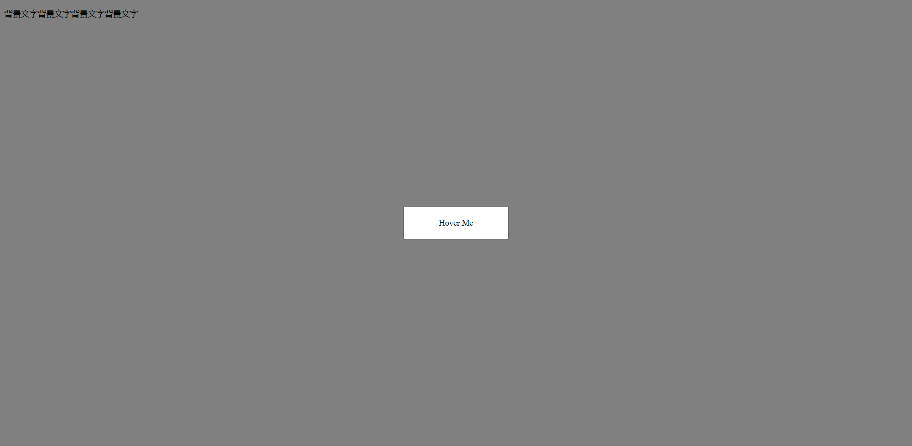

# css

## 布局

### 实现水平居中(简便)

父元素设置display:flex,子元素设置margin:auto

HTML:

```html
    <div class="g-container">
        <div class="g-box">
            <div class="g-box2"></div>
        </div>
     </div>
```

CSS:

```css
.g-container {
            width: 100vw;
            height: 100vh;
            display: grid;
            // display: grid;
            // display: inline-flex;
            // display: inline-grid;
        }

        .g-box {
            width: 40vmin;
            height: 40vmin;
            background-color: #000;
            margin: auto;
            display: flex;
        }

        .g-box2 {
            width: 20vmin;
            height: 20vmin;
            background-color: blue;
            margin: auto;
        }
```


### 双飞翼布局

**通过控制 middle 的子容器的 margin 或者 padding 空出左右两列的宽度**

SCSS:

```scss
.g-container {
    position: relative;
    height: 100vh;
    min-width: 400px;
    
    & > div {
        height: 100vh;
        float: left;
        text-align: center;
        color: #fff;
        line-height: 100vh;
        font-size: 3vw;
    }
}

.g-middle {
    position: relative;
    width: 100%;
    background: #cc6630;
    .g-middle-inner {
        margin: 0 200px;
    }
}

.g-left {
    position: relative;
    width: 200px;
    background: #ffcc00;
    margin-left: -100%;//父元素宽度
}

.g-right {
    position: relative;
    width: 200px;
    background: pink;
    margin-left: -200px;
}
```

HTML:

```html
 <div class="g-container">
        <div class="g-middle">
            <div class="g-middle-inner">middle-inner</div>
        </div>
        <div class="g-left"></div>
        <div class="g-right"></div>
    </div>
```


### flex实现圣杯布局

## 阴影

### box-shadow实现圆环进度条动画

HTML:

```html
	<div class="container">
        <div class="shadow">Hover Me</div>
    </div>
```

SCSS:

```scss
$color: #e91e63;
body {
	background-color: #000;
}
.container {
	position: relative;
	overflow: hidden;
	width: 124px;
	height: 124px;
	margin: 100px auto;
	border-radius: 50%;
}
.shadow {
	position: absolute;
	top: 50%;
	left: 50%;
	transform: translate(-50%, -50%);
	width: 120px;
	height: 120px;
	line-height: 120px;
	border-radius: 50%;
	color: #fff;
	font-size: 20px;
	cursor: pointer;
	box-shadow: 60px -60px 0 2px $color, -60px -60px 0 2px $color,
		-60px 60px 0 2px $color, 60px 60px 0 2px $color;
	text-align: center;
	&:hover {
		animation: border 0.5s ease forwards;
	}
}
@keyframes border {
	0% {
		box-shadow: 60px -60px 0 2px $color, -60px -60px 0 2px $color,
			-60px 60px 0 2px $color, 60px 60px 0 2px $color, 0 0 0 2px transparent;
	}
	25% {
		box-shadow: 0 -125px 0 2px $color, -60px -60px 0 2px $color,
			-60px 60px 0 2px $color, 60px 60px 0 2px $color, 0 0 0 2px #fff;
	}
	50% {
		box-shadow: 0 -125px 0 2px $color, -125px 0px 0 2px $color,
			-60px 60px 0 2px $color, 60px 60px 0 2px $color, 0 0 0 2px #fff;
	}
	75% {
		box-shadow: 0 -125px 0 2px $color, -125px 0px 0 2px $color,
			0px 125px 0 2px $color, 60px 60px 0 2px $color, 0 0 0 2px #fff;
	}
	100% {
		box-shadow: 0 -125px 0 2px $color, -125px 0px 0 2px $color,
			0px 125px 0 2px $color, 120px 40px 0 2px $color, 0 0 0 2px #fff;
	}
}
```


### box-shadow实现半透明遮罩

HTML:

```html
    <div>
        <p>背景文字背景文字背景文字背景文字</p>
        <div class="bs">Hover Me</div>
    </div>
```

SCSS:

```scss
.bs {
	position: absolute;
	width: 200px;
	height: 60px;
	line-height: 60px;
	text-align: center;
	border: 1px solid #666;
	cursor: pointer;
	top: 50%;
	left: 50%;
	transform: translate(-50%, -50%);
	transition: all 0.1s;
	&:hover {
		box-shadow: 0 0 0 500px rgba(0, 0, 0, 0.5);
	}
}
```



### 伪元素实现边界智能判断移动

HTML:

```html
	<div class="box">
        <div class="box__right">Right → Left</div>
        <div class="box__left">Left → Right</div>
        <div class="box__top">Top → Bottom</div>
        <div class="box__bottom">Bottom → Top</div>
        <div class="box__center">Hover from any side</div>
    </div>
```

SCSS:

```scss
.box {
	margin: 5em auto;
	position: relative;
	width: 10em;
	height: 10em;
	line-height: 10em;
	overflow: hidden;
}
.box__right,
.box__left,
.box__top,
.box__bottom,
.box__center {
	position: absolute;
	width: inherit;
	height: inherit;
	text-align: center;
	line-height: inherit;
	transition: transform 0.4s ease;
}
.box__right:before,
.box__left:before,
.box__top:before,
.box__bottom:before,
.box__center:before {
	position: absolute;
	content: "";
	width: 70.71%;
	height: 70.71%;
	transform: rotate(45deg);
}
.box__right:hover,
.box__left:hover,
.box__top:hover,
.box__bottom:hover,
.box__center:hover {
	transform: translateX(0);
	z-index: 1;
}
.box__right:hover:before,
.box__left:hover:before,
.box__top:hover:before,
.box__bottom:hover:before,
.box__center:hover:before {
	width: 100%;
	height: 100%;
	transform: none;
}
.box__right {
	background-color: blue;
	transform: translateX(100%);
}
.box__right::before {
	right: 100%;
	bottom: 0;
	transform-origin: 100% 100%;
}
.box__right:hover ~ .box__center {
	transform: translateX(-100%);
}

.box__left {
	background: green;
	transform: translateX(-100%);
}

.box__left:before {
	left: 100%;
	transform-origin: 0 0;
}

.box__left:hover ~ .box__center {
	transform: translateX(100%);
}

.box__top {
	background: red;
	transform: translateY(-100%);
}

.box__top:before {
	top: 100%;
	right: 0;
	transform-origin: 100% 0;
}

.box__top:hover ~ .box__center {
	transform: translateY(100%);
}

.box__bottom {
	background: yellow;
	transform: translateY(100%);
}

.box__bottom:before {
	bottom: 100%;
	left: 0;
	transform-origin: 0 100%;
}

.box__bottom:hover ~ .box__center {
	transform: translateY(-100%);
}

.box__center {
	background: orange;
	z-index: -1;
}
```


# js


### 防抖

返回函数连续调用时，间隔时间必须大于或等于wait，func才执行

```js
//第一次立即执行，可取消
function debounce(fn, delay, immediate) {
	let timer = null;
	let isInvoke = false;
	function _debounce(...args) {
		if (timer) clearTimeout(timer);
		if (immediate && !isInvoke) {
			fn.apply(this, args);
			isInvoke = true;
		} else {
			timer = setTimeout(() => {
				fn.apply(this.args, args);
				isInvoke = false;
				timer = null;
			}, delay);
		}
	}
	_debounce.cancel = function () {
		if (timer) clearTimeout(timer);
		timer = null;
		isInvoke = false;
	};
	return _debounce;
}
```


```js
     function debounce(func, wait = 500, immediate = true) {
            let timer, context, args;
            const later = () =>
                setTimeout(() => {
                    // 如果immediate为true 清空timer执行else条件下语句
                    timer = null;
                    if (!immediate) {
                        func.apply(context, args);
                        context = args = null;
                    }
                }, wait);
            return function (...params) {
                //第一次执行
                if (!timer) {
                    //执行setTimeout 由于定时器是宏任务，所以会等下面的条件判断后再执行
                    timer = later();
                    if (immediate) {
                        func.apply(this, params);
                    } else {
                        context = this;
                        args = params;
                    }
                } else {
                    clearTimeout(timer);
                    timer = later();
                }
            };
        }

```

### 节流

特定时间内只执行一次函数

```js
function throttle(fn, interval, options = { leading: true, trailing: false }) {
	const { leading, trailing } = options;
	let lastTime = 0;
	let timer = null;
	const _throttle = function (...args) {
		const nowTime = new Date().getTime();
		if (!lastTime && !leading) lastTime = nowTime;
		const remainTime = interval - (nowTime - lastTime);

		if (remainTime <= 0) {
			if (timer) {
				clearTimeout(timer);
				timer = null;
			}
			fn.apply(this, args);
			lastTime = nowTime;
			return;
		}
		if (trailing && !timer) {
			timer = setTimeout(() => {
				timer = null;
				lastTime = !leading ? 0 : new Date().getTime();
				fn.apply(this, args);
			}, remainTime);
		}
	};
	_throttle.cancel = function () {
		if (timer) clearTimeout(timer);
	};
	return _throttle;
}
```


### 科里化函数实现

```js
	function qweCurrying(fn) {
			return function curried1(...args1) {
				//如果传入参数大于等于需要传的参数
				if (args1.length >= fn.length) {
					return fn.apply(this, args1)
				} else {
					//递归
					return function curried2(...args2) {
						return curried1.apply(this, [...args1, ...args2])
					}
				}
			}
		}
```

### 深拷贝

```js
function isObject(value) {
	const valueType = typeof value;
	return value !== null && (valueType === "object" || value === "function");
}
function deepClone(originValue, map = new WeakMap()) {
	//map
	if (originValue instanceof Map) {
		return new Map([...originValue]);
	}
	//set
	if (originValue instanceof Set) {
		return new Set([...originValue]);
	}
	//symbol
	if (typeof originValue === "symbol") {
		return Symbol(originValue.description);
	}
	//function
	if (typeof originValue === "function") {
		return originValue;
	}
	//基本类型
	if (!isObject(originValue)) {
		return originValue;
	}
	if (map.has(originValue)) {
		return map.get(originValue);
	}
	const newObject = Array.isArray(originValue) ? [] : {};
	map.set(originValue, newObject);
	for (let key in originValue) {
		newObject[key] = deepClone(originValue[key], map);
	}
	//key为Symbol做处理
	const symbolKeys = Object.getOwnPropertySymbols(originValue);
	for (let key of symbolKeys) {
		newObject[key] = deepClone(originValue[key], map);
	}
	return newObject;
}
const obj = {
	name: "qweqe",
	age: 18,
	obj: { a: "ewe" },
	arr: ["sd", "dsd"],
	fn: function () {
		console.log("function");
		return fn;
	},
	sym: Symbol("dff"),
	[Symbol("df")]: "dsd",
	map: new Map([["a", "s"]]),
	set: new Set(["fdf", "dff"]),
};
```


### 大量数据加载

```js
   setTimeout(() => {
            //总数据
            const total = 10000
            //一次性插入的数据
            const once = 20
            //循环次数
            const loopCount = total / once;
            let countOfRender = 0;
            let ul = document.querySelector("ul")
            function add() {
                const fragment = document.createDocumentFragment();
                for (let i = 0; i < once; i++) {
                    const li = document.createElement('li')
                    li.innerText = Math.floor(Math.random() * total);
                    fragment.appendChild(li);
                }
                ul.appendChild(fragment);
                countOfRender += 1
                loop()
            }
            function loop() {
                if (countOfRender < loopCount) {
                    window.requestAnimationFrame(add)
                }
            }
            loop()
        }, 0)

```

### 小于10的数字加上0

```js
function padLeftZero(time) {
  time = time + ''
  return ("00" + time).slice(time.length)
}

```

### 根据某个属性对数组里的对象进行分类

```js
//根据某个属性对数组里的对象进行分类
export function formatArrayWithAttr(arr, attr) {
  let list = [], obj = {}
  //根据obj的属性操作list
  arr.forEach(item => {
    if (!obj[item[attr]]) {
      //list数组push
      list.push({
        [attr]: item[attr],
        allData: [item]
      })
      obj[item[attr]] = item
    } else {
      //向list相应数组项push
      list.forEach(el => {
        if (el[attr] == item[attr]) {
          el.allData.push(item)
        }
      })
    }
  })
  return list
}
```


# ts

### localStorage

```js
class LocalCache {
  setCache(key: string, value: any) {
    window.localStorage.setItem(key, JSON.stringify(value));
  }
  getCache(key: string) {
    const value = window.localStorage.getItem(key);
    if (value) {
      return JSON.parse(value);
    }
  }
  deleteCache(key: string) {
    window.localStorage.removeItem(key);
  }
  clearCache() {
    window.localStorage.clear();
  }
}
export default new LocalCache();

```

# 微信小程序

### 把大的数字转成XX万、XX亿

```js
// format.wxs
// 不支持es6
function formatCount(count){
  //转成数字
  var counter = parseInt(count)
  if(counter > 100000000){
      return (counter / 100000000).toFixed(1) + '亿'
  }else if(counter > 10000){
      return (counter / 10000).toFixed(1) + '万'
  }else {
    return counter + ''
  }
}
//common.js
module.exports = {
  formatCount : formatCount
}
```


# vue

### 数字动画(vue)

```js
<template>
	<div>
		<button @click="addNum">添加数字</button>
		<button @click="delNum">删除数字</button>
		<button @click="shuffleNum">洗牌</button>
	</div>
	<transition-group name="qwe">
		<span v-for="item in numbers" :key="item" class="item">{{ item }}</span>
	</transition-group>
</template>

<script>
import _ from "lodash";

export default {
	name: "App",
	data() {
		return {
			numbers: [0, 1, 2, 3, 4, 5, 6, 7, 8, 9],
			numCounter: 10,
		};
	},
	methods: {
		addNum() {
			this.numbers.splice(this.randomIndex(), 0, this.numCounter++);
		},
		delNum() {
			this.numbers.splice(this.randomIndex(), 1);
		},
		shuffleNum() {
			this.numbers = _.shuffle(this.numbers);
		},
		randomIndex() {
			return Math.floor(Math.random() * this.numbers.length);
		},
	},
};
</script>

<style scoped>
.item {
	margin-right: 10px;
	display: inline-block;
}

.qwe-enter-from,
.qwe-leave-to {
	opacity: 0;
	transform: translateY(30px);
}
.qwe-enter-active,
.qwe-leave-active {
	transition: all 1s ease;
}
.qwe-leave-active {
	position: absolute;
}
.qwe-move {
	transition: transform 1s ease;
}
</style>
```


### 列表交替过度

```js
<template>
	<div>
		<input v-model="keyword" />
		<transition-group
			tag="ul"
			name="qwe"
			:css="false"
			@enter="enter"
			@leave="leave"
			@beforeEnter="beforeEnter"
		>
			<li v-for="(item, index) in showNames" :key="item" :data-index="index">
				{{ item }}
			</li>
		</transition-group>
	</div>
</template>

<script>
import gsap from "gsap";
export default {
	data() {
		return {
			names: ["qwe", "weee", "ddf", "dff", "gff"],
			keyword: "",
		};
	},
	computed: {
		showNames() {
			return this.names.filter((item) => item.indexOf(this.keyword) !== -1);
		},
	},
	methods: {
		beforeEnter(el) {
			el.style.opacity = 0;
			el.style.height = 0;
		},
		enter(el, done) {
			gsap.to(el, {
				opacity: 1,
				height: "1.5em",
				delay: el.dataset.index * 0.5,
				onComplete: done,
			});
		},
		leave(el, done) {
			gsap.to(el, {
				opacity: 0,
				height: 0,
				onComplete: done,
			});
		},
	},
};
</script>

<style scoped></style>
```


### vue3 在setup里一次性导入state

```js
import { computed } from "vue";
import { mapState, useStore } from "vuex";
export function useState(mapper) {
	const store = useStore();
	const storeStateFns = mapState(mapper);
	const storeState = {};
    
	Object.keys(storeStateFns).forEach((item) => {
		const fn = storeStateFns[item].bind({ $store: store });//绑定this
		storeState[item] = computed(fn);
	});
	return storeState;
}

```

